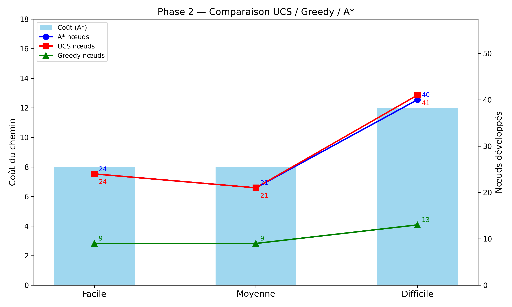
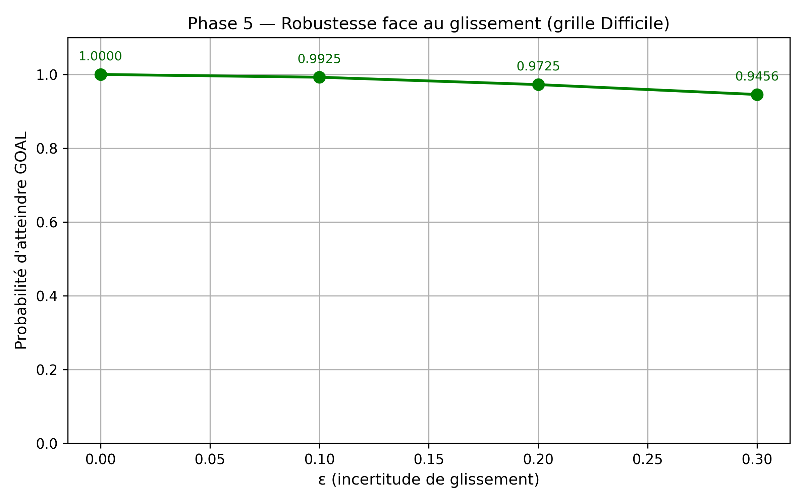
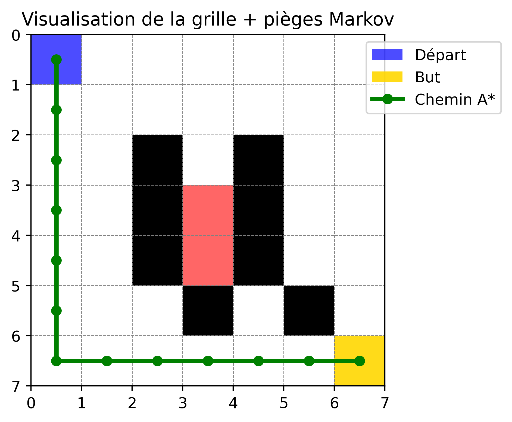

# Planification Robuste sur Grille : A* + Chaînes de Markov

**Auteure :** Wijdane AARROUB  
**Date :** 3 mars 2026  
**Filière :** Master Sciences de Données et Intelligence Artificielle (SDIA) – ENSET Mohammedia  
**Encadrant :** M. Mohamed MESTARI

## Objectif
Implémentation hybride : planification optimale avec **A*** (heuristique Manhattan admissible) + modélisation de l’incertitude avec **Chaînes de Markov** (glissement ε).

## Structure du projet
- `grid.py` – Environnement
- `astar.py` – A*, UCS, Greedy, h=0
- `markov.py` – Matrice P, classes de communication, probabilité d’absorption **exacte**
- `utils.py` – Graphiques + visualisation grille + piège
- `experiments.py` – Phases 1 à 5 + E.1/E.2/E.3
- `main.py` – Point d’entrée

## Résultats (extrait console)
- Grille Difficile : Probabilité exacte = **0.9742** (simulation ≈ 0.9735)
- Classe piège détectée : `[(3,3), (3,4)]` → **RÉCURRENT (PIÈGE)**

## Visualisations générées
  
  


## Exécution
```bash
pip install numpy networkx matplotlib
python main.py
```