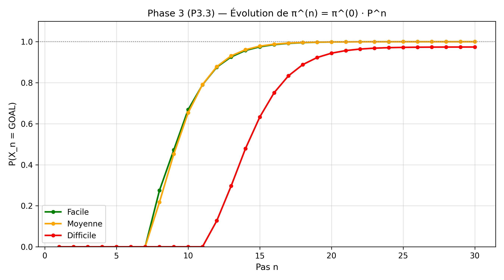
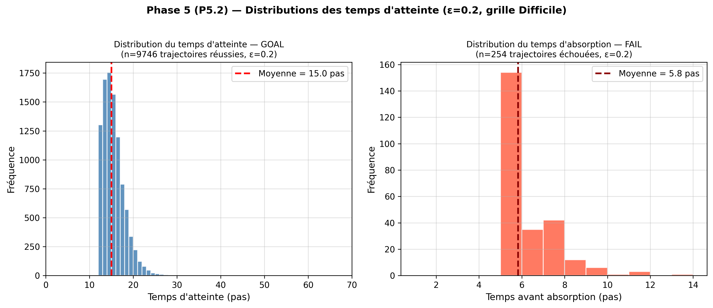
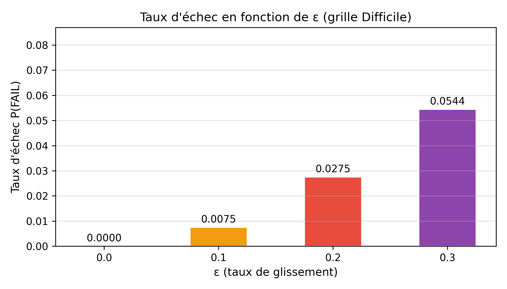

# Planification Robuste sur Grille : A* + Chaînes de Markov

**Auteure :** Wijdane AARROUB  
**Date :** 3 mars 2026  
**Filière :** Master Sciences de Données et Intelligence Artificielle (SDIA) – ENSET Mohammedia  
**Encadrant :** M. Mohamed MESTARI

## Objectif
Implémentation hybride : planification optimale avec **A\*** (heuristique Manhattan admissible) + modélisation de l'incertitude avec **Chaînes de Markov** (glissement ε).

## Structure du projet
- `grid.py` – Environnement (grille 2D, obstacles, voisins)
- `astar.py` – A*, UCS, Greedy Best-First, Weighted A*, h=0
- `markov.py` – Matrice P, π^(n), classes de communication, probabilité d'absorption **exacte**
- `utils.py` – Graphiques + visualisation grille + états FAIL
- `experiments.py` – Phases 1 à 5 + E.1/E.2/E.3
- `main.py` – Point d'entrée

## Résultats clés

### Phase 2 — Comparaison algorithmes (grille Difficile)
| Algorithme     | Coût | Nœuds développés |
|----------------|------|------------------|
| A* (Manhattan) | 12   | 40               |
| UCS            | 12   | 41               |
| Greedy pur     | 12   | 13               |

### Phase 4 — Classes de communication
- Classe piège détectée : `[(3,3), (3,4)]` → **RÉCURRENT ABSORBANT — FAIL**
- État but : `[(6,6)]` → **RÉCURRENT ABSORBANT — GOAL**

### Phase 5 — Probabilités d'absorption (ε = 0.2, grille Difficile)
- Probabilité exacte P(GOAL) = **0.9742** | P(FAIL) = **0.0258**
- Simulation Monte-Carlo (N=10 000) : P(GOAL) ≈ **0.9746** | écart = **0.0004**
- Temps moyen d'atteinte GOAL : **15.0 pas** | absorption FAIL : **5.8 pas**

### Expérience E.2 — Sensibilité à ε
| ε   | P(GOAL) | P(FAIL) |
|-----|---------|---------|
| 0.0 | 1.0000  | 0.0000  |
| 0.1 | 0.9925  | 0.0075  |
| 0.2 | 0.9725  | 0.0275  |
| 0.3 | 0.9456  | 0.0544  |

## Visualisations générées







## Exécution
```bash
pip install numpy networkx matplotlib
python main.py
```